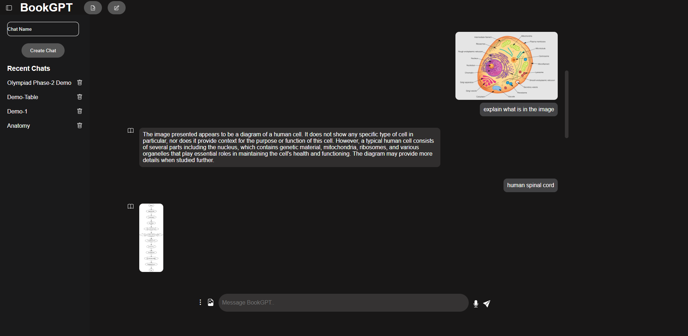
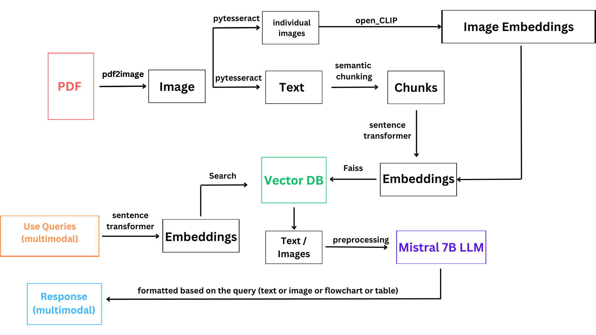

# BookGPT

## About BookGPT
BookGPT is an advanced Retrieval-Augmented Generation (RAG) system built using the Mistral 7B LLM. Designed to enhance learning and accessibility, BookGPT allows users to interact with a vast repository of knowledge by asking questions directly related to the content of specific books. Initially, the system is focused on three key anatomy books, making it an invaluable tool for students and professionals in the medical field. As the system evolves, it will expand to include a feature that enables users to upload any PDF document, broadening its applicability across various subjects and disciplines. This combination of powerful language modeling and flexible content integration makes BookGPT a versatile and innovative solution for personalized learning and information retrieval.

## BookGPT UI


## Features

### Available Features :
- ✅**Chat with any PDF :**
  We successfully added custom PDF upload functionality that will allow users to upload any PDF file to BookGPT and ask questions about the content within it.
- ✅**Local Chat History :**
  All chats are stored in a PostgreSQL Database. So every chat history is retained.
- ✅**Anatomy Books Integration :**
  We have successfully added 3 anatomy books (Vol 1, Vol 2, Vol 3) to the Retrieval-Augmented Generation (RAG) system. Users can now ask BookGPT questions related to these books.
- ✅**Image Search Compatibility :**
  We successfully added Image based retrieval of the content in the PDF file
- ✅**Generating Flowcharts :**
  We successfully added the feature that generates flowcharts to user prompts when it is enabled.
- ✅**Table Generation :**
  We successfully comleted the feature that generates tabular data base on the given context.


## Demo
[Watch Demo](https://drive.google.com/file/d/1DPhe-r46FASzqAcGvLDXKTVrYUTY6Poj/view?usp=sharing)

## Our RAG Architecture


## Micro-Service Architecture


## How to Run BookGPT
### Required Tools
  - Node JS
  - PostgreSQL
  - Python 3.9
  - Ollama


### Clone the repository
  ```
  git clone https://github.com/surya54101q/RAG-2.git
  ```
  ```
  cd RAG-2
  ```

### Configuring Database
  - Create Database named "BookGPT" in your pgAdmin
  - Create a .env file inside JavaScriptServer repository and add the following variables
    ```
    user="postgres"
    host="localhost"
    database="BookGPT"
    password=<Your PostgreSQL password>
    port=5432
    ```
### Setting up Ollama:
- Install Ollama from [here](https://ollama.com/)

- ```
  ollama pull mistral
  ```

### Installing Frontend

  - Install Dependencies from the package.json file
    ```
    cd JavaScriptServer
    ```
    ```
    npm i
    ```
  - Starting the NodeJS Server
    ```
    npm start
    ```
    This runs the server on the port 3000. Visit http://localhost:3000 to access the frontend

### Installing Backend

  - Intstall python version 3.9

  - Create a virtual environment

  - To install all the dependencies
    ```
    pip install requirements.txt
    ```
  - To start the backend server
    ```
    python app.py
    ```
